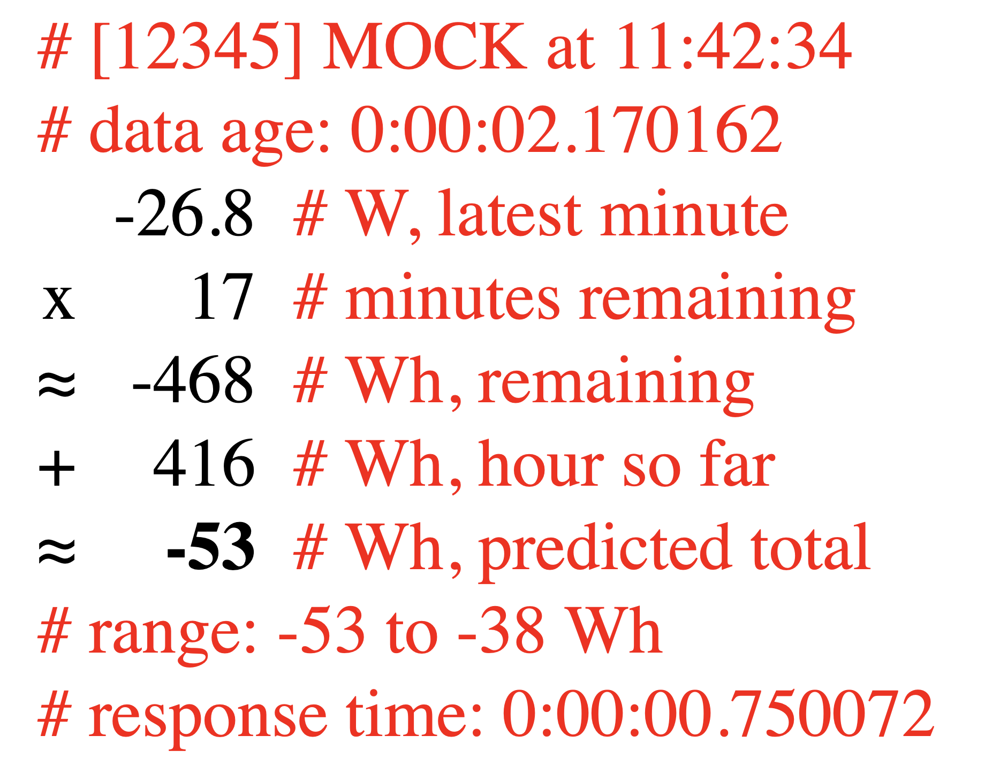

# Hourly Predicted Usage for Emporia VUE Utility Connect

If you have rooftop solar and some flavor of net energy metering
(NEM), you may want to consume as much of your solar output as
possible, as measured on an hourly basis.  For example this is useful
to minimize non-bypassable charges (NBCs) under California's NEM2
regime.

By predicting the total energy produced or consumed in the coming
hour, this project can help you shift energy usage to maximize
self-consumption and minimize NBCs.

What you'll need:

* [Emporia VUE Utility Connect](https://www.emporiaenergy.com/how-the-vue-utility-connect-works)
* A compatible smart meter
* A suitable python web service environment

Before getting started with this project, configure your Emporia VUE
Utility Connect to receive data from your smart meter.

Then deploy to a suitable python environment.
The button below should make it easy to deploy to Render:

[](
https://render.com/deploy?repo=https://github.com/mblakele/solara)

If that doesn't work, you can still deploy to [Render](https://render.com)
manually, or you can run locally, or deploy to pretty much any
[python](https://www.python.org) environment.

Once set up, you'll be able to view a simple web page showing how much
energy your system has used or generated for the current hour,
and how much it's likely to generate by the end of the
current hour.  You can also use a simple HTTP GET request to fetch
these metrics in JSON format, suitable for home automation.

The prediction is based on per-second energy usage for the past ten
minutes, as reported by your smart meter through the VUE Utility
Connect. The prediction won't always be correct, but I hope you'll
find it useful.

## Render Setup

Besides your Emporia VUE Utility Connect and a compatible smart meter,
you'll need a [render](https://render.com) account.
You should be able to run this project under render's free tier.

Create a new web service on render.com using python and flask,
as described here:

https://render.com/docs/deploy-flask

However in step one, instead of forking flask-hello-world
**fork this repository**.

Note that requests will only show `MOCK` data until you configure
the new web service with your Emporia credentials and deploy again.
This means trusting render with your Emporia username and password.
Do this at your own risk, and take reasonable precautions.
Use a strong password, and one that's unique to your Emporia account.

To configure the web service with your Emporia account credentials,
visit the `Environment` section of your web service in the
[render dashboard](http://dashboard.render.com). Add these environment
variables:

* VUE_USERNAME
* VUE_PASSWORD

After setting these credentials, deploy the web service again.
You should now see live data from your VUE Utility Connect.

## Local Setup

You can also run this project locally, or adapt these instructions
to pretty much any [python](https://www.python.org) environment.

Requirements:

* [git](https://git-scm.com)
* [python3](https://www.python.org)

First, clone this repository:

```
git clone https://github.com/mblakele/solara.git
```

Next, install the python requirements:

```
pip3 install -r requirements.txt
```

Next, the local server will need your Emporia account credentials.
Configure these by creating a `.env` file in your local copy of the
source code.

**Never check the `.env` file into source control.**

```
# Never check this file into source control!
#
# Enable debug for local development, if desired.
#DEBUG=True
VUE_USERNAME=yourEmporiaUsername
VUE_PASSWORD=yourEmporiaPassword
```

Finally, start a local server with:

```
gunicorn app:app
```

For development work you may prefer this:

```
gunicorn --reload \
    --reload-extra-file .env \
    --reload-extra-file templates \
    app:app
```

The output should look something like this:

```
[2022-08-27 11:01:41 -0700] [67121] [INFO] Starting gunicorn 20.1.0
[2022-08-27 11:01:41 -0700] [67121] [INFO] Listening at: http://127.0.0.1:8000 (67121)
[2022-08-27 11:01:41 -0700] [67121] [INFO] Using worker: sync
[2022-08-27 11:01:41 -0700] [67123] [INFO] Booting worker with pid: 67123
```

Test the server by opening the `Listening at:` link from the output.
In the sample above, that's:

[http://127.0.0.1:8000](http://127.0.0.1:8000)

## Sample HTML Output



Here's a screenshot of a sample html view. This is meant to be
readable on mobile devices, and the output should be fairly
self-explanatory.  Here's what you can read on each line:

1. Device info and request timestamp, mapped to the device's timezone
1. Minutes remaining in the current hour
1. Energy produced or consumed in the last 60 seconds
1. Result of multiplying minutes remaining by the most recent minute's energy
1. Energy produced or consumed in the hour so far
1. Estimated total energy for the hour, **in bold**
1. Minimum and maximum estimate, based on up to 10 minutes of data
1. How long the Emporia API took to respond
1. Lag, or the age of the most recent data in the Emporia API response

## Sample JSON Request

Substitute the correct hostname in the URL below.

```
curl -H 'Accept: application/json' \
  'https://fubar-12345.onrender.com'
```

Sample output:

```
{
  "api_response": {
    "get_chart_usage/1,2,3": "P0DT00H00M00.677919S",
    "total": "P0DT00H00M00.677919S"
  },
  "debug": false,
  "devices": [
    {
      "gid": 654321,
      "lag": "P0DT00H00M06.279410S",
      "name": "fubar",
      "minute_predicted": -8.23541694800059,
      "minutes_remaining": 9.833333333333334,
      "prediction": -27.6879148912382,
      "prediction_min": -27.6879148912382,
      "prediction_max": -22.758956398742814,
      "scales": {
        "1H": {
          "instant": "2022-03-08T20:50:10Z",
          "usage": -19.45249794323761
        },
        "1MIN": {
          "usage": -0.8375000286102295
        },
        "2MIN": {
          "usage": -0.7937500305308247
        },
        "3MIN": {
          "usage": -0.787500029890627
        },
        "4MIN": {
          "usage": -0.7140625274926442
        },
        "5MIN": {
          "usage": -0.6456250248617615
        },
        "6MIN": {
          "usage": -0.5750000218164057
        },
        "7MIN": {
          "usage": -0.5196428765190988
        },
        "8MIN": {
          "usage": -0.4531250170204389
        },
        "9MIN": {
          "usage": -0.3958333481829856
        },
        "10MIN": {
          "usage": -0.33625001242425817
        }
      },
      "smoothing": {
        "1MIN": -27.6879148912382,
        "2MIN": -27.25770657679072,
        "3MIN": -27.19624823716211,
        "4MIN": -26.47411279691528,
        "5MIN": -25.801144021044934,
        "6MIN": -25.106664824432265,
        "7MIN": -24.562319562342083,
        "8MIN": -23.908227277271926,
        "9MIN": -23.3448592003703,
        "10MIN": -22.758956398742814
      },
      "timezone": "America/Los_Angeles"
    }
  ],
  "instant": "2022-03-08T20:50:16.279Z"
}
```

As you can see, the JSON data includes information that isn't
available in the HTML view. For example you can see projections based
on the past minute (`1M`), but also based on the past 2, 3, 4, 5, 6,
7, 8, 9, and 10 minutes.  This data may be useful for custom
integrations.

## Accuracy

The code in this project can't see into the future. Instead it looks
at the hour so far, and especially the past 60 seconds, to estimate
how the rest of the current hour might go. Much of the time this works
pretty well.  However, the accuracy of these estimates will vary
depending on several factors including, but not limited to:

* changes in solar output
* changes in energy use
* beginning of the hour
* data age (lag)
* data accuracy

As the sun rises and sets, and as the weather changes, so does the
output of your panels. The code in this project does not try to
account for that. This can affect accuracy, especially in
circumstances such as partly cloudy weather or at times of day when
the amount of sunlight reaching your panels is changing rapidly.

Changes in your energy use can also influence accuracy, because this
code projects usage for the rest of the hour based on the most recent
60 seconds of Emporia data. For example if your electic water heater
runs for five minutes, then turns off, the prediction will reflect
that usage. However the prediction should improve over time, as the
water heater's usage moves out of the running 60-second window.

At the beginning of the hour, this code has limited data for
projections.  For example there may be less than 60 seconds of data
available.  Accuracy should improve once the first minute or so of
data is available.

Data age, or lag, can influence accuracy for the same reasons.  As
you'll observe, data from the Emporia API often lags by seconds, and
sometimes by minutes. If your solar output or energy usage change
quickly, and Emporia's available data is lagging, the prediction won't
be as accurate.

To help with these variables, this code makes a primary prediction
based on the last minute, plus predictions for various time intervals
up to 10 minutes.  The HTML view shows the minimum and maximum these
predictions.  In the JSON data, each time interval is broken out and
labeled: 1M, 2M, 3M, etc.

Finally, at times the data coming from Emporia Energy's APIs may not
be as accurate as we would all like. This could be due to faults at
your smart meter, or its communication with the VUE Utility Connect,
or its communication with Emporia Energy's backend servers, or in
those servers. In any case, keep in mind that the code in this project
can only make predictions using the available data.

## Caching

The web service will cache your authentication tokens
and Emporia VUE Utility Connect device info.
This information should refresh as needed.

If the web service seems to be hanging on to stale authentication
or device information, try restarting the web service.

## Contributing

Yes, please!

## Troubleshooting

### Data is very old and has MOCK label

The web service can't find your Emporia account credentials,
so it's showing static test data.
Revisit the Setup section and configure the Emporia account credentials.

* `VUE_USERNAME`
* `VUE_PASSWORD`

### NotAuthorizedException

```
An error occurred (NotAuthorizedException) when calling the
RespondToAuthChallenge operation: Incorrect username or password.
```

One or both of the Emporia account credentials are probably wrong.

* `VUE_USERNAME`
* `VUE_PASSWORD`

### UserNotFoundException

```
An error occurred (UserNotFoundException) when calling the
InitiateAuth operation: User does not exist.
```

Check the `VUE_USERNAME` for errors. Make sure it matches your
Emporia account username exactly.

## Acknowledgments

Thanks to
[Emporia Energy](https://www.emporiaenergy.com)
and to
[PyEmVue](https://github.com/magico13/PyEmVue/pyemvue).
