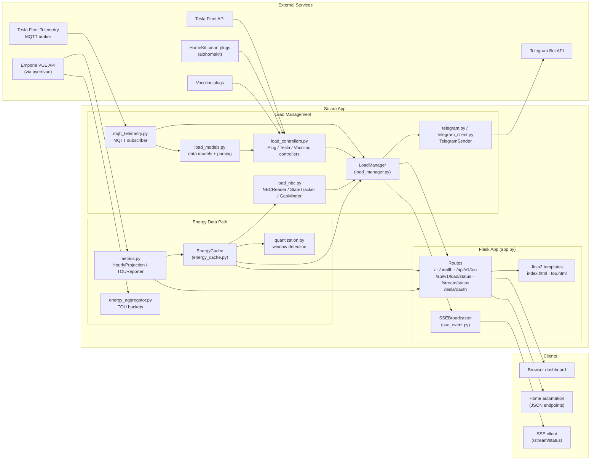
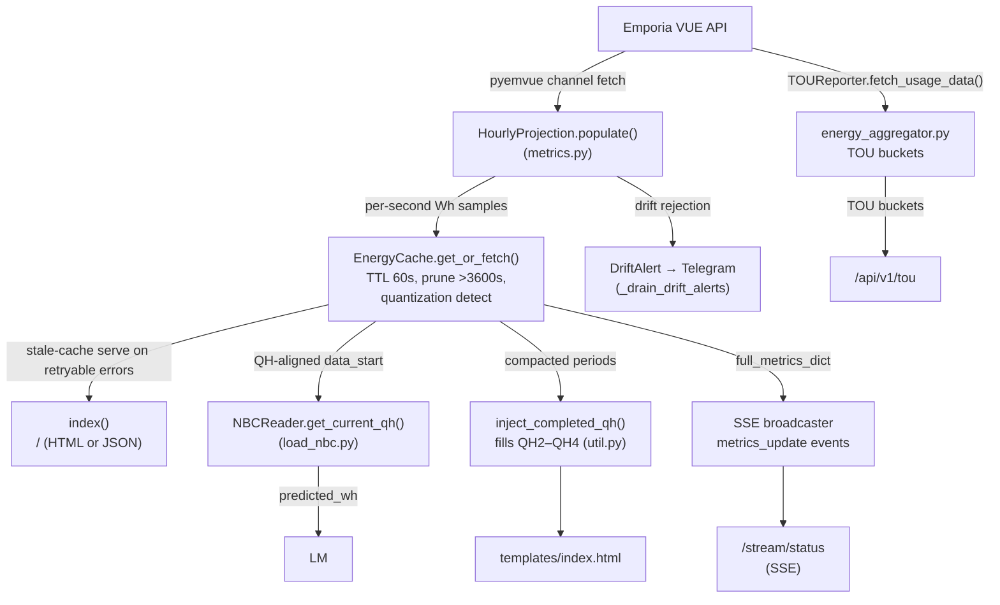
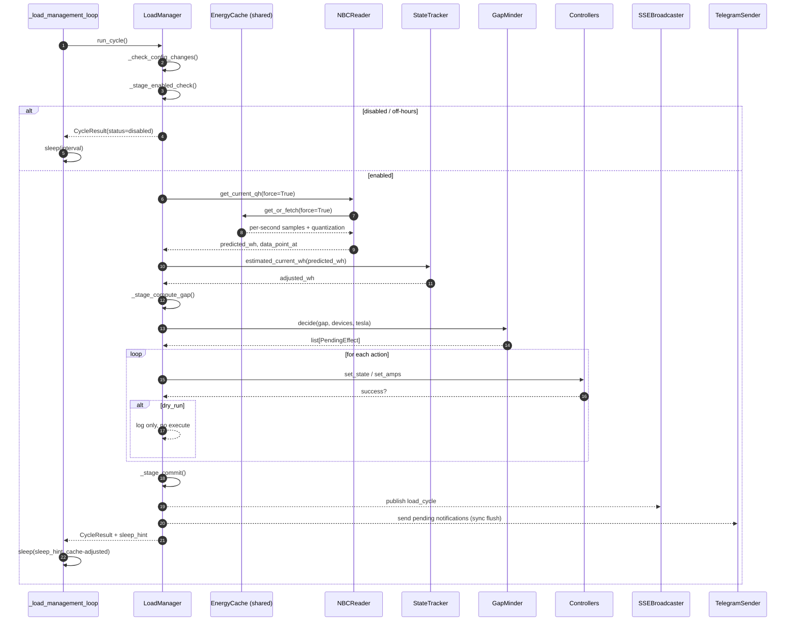
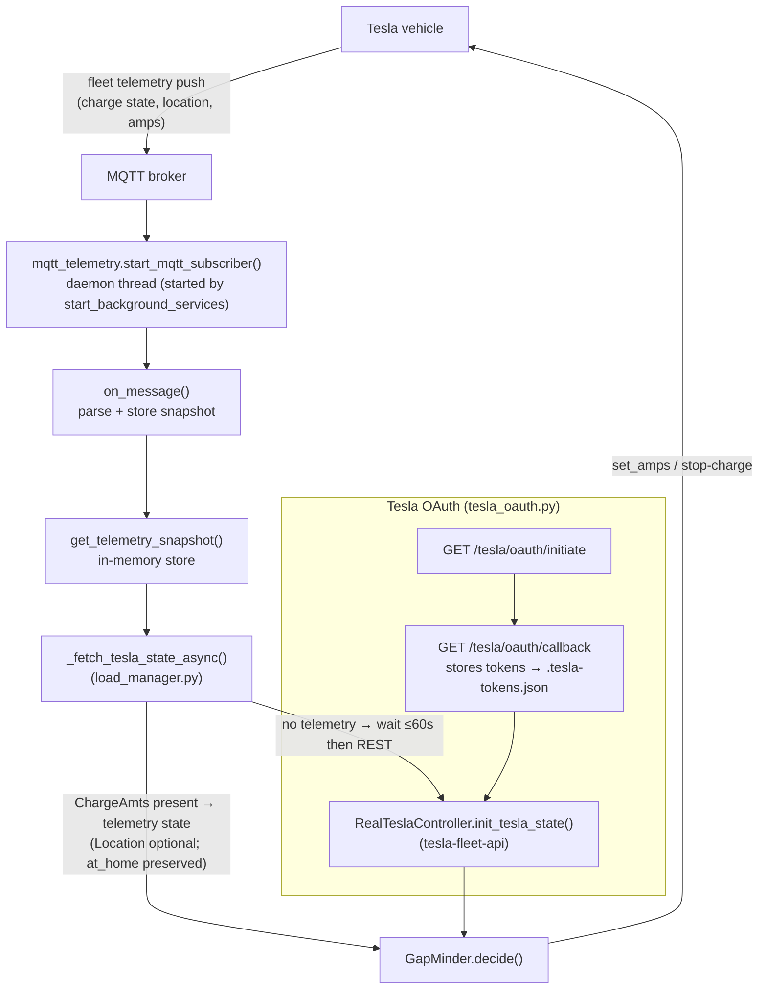
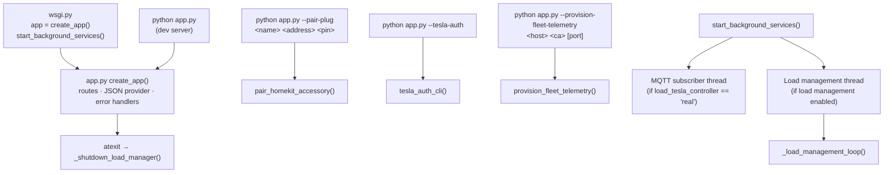

# Solara Architecture Diagrams

Mermaid diagrams describing the Solara system: the Flask web app, the energy
prediction pipeline, and the load management subsystem that controls smart
plugs and Tesla charging to maximize solar self-consumption.

## 1. System Overview

External services on the left (Emporia VUE, Tesla, Telegram) feed data in;
the app's core modules in the middle process it; clients on the right consume
it.

## 2. Metrics / Data Flow (index, TOU, SSE)

The `EnergyCache` is the shared per-second sample store: the web layer, the
NBC reader, and the load manager all read from it. Completed quarter-hours are
compacted into `CompletedNBCPeriod` objects and injected back into
quarter-hour windows (`util.inject_completed_qh`).

## 3. Load Management Cycle

`LoadManager.run_cycle()` runs a seven-stage pipeline every ~30 seconds on a
background thread (or adaptively per `sleep_hint`). Each stage is an
independently testable method; any stage may early-exit with a `CycleResult`.

```mermaid
flowchart LR
    LOOP["_load_management_loop()<br/>background thread (app.py)"]
    LOOP --> CYCLE["run_cycle()<br/>guarded by self._lock"]

    CYCLE --> S0["0. _check_config_changes()<br/>reload .env / devices.json"]
    S0 --> S1["1. _stage_enabled_check()<br/>disabled / outside time window?"]
    S1 -->|"early exit"| RESULT["CycleResult"]

    S1 -->|"enabled"| S2["2. _stage_nbc_fetch()<br/>NBCReader.get_current_qh(force=True)<br/>→ drains DriftAlerts"]
    S2 -->|"stale / no data"| RESULT
    S2 -->|"predicted_wh"| S3["3. _stage_pending_check()<br/>data-point age vs STALE_DATA_THRESHOLD_SECS<br/>pending effects not yet reflected?"]

    S3 -->|"early exit"| RESULT
    S3 -->|"ok"| S4["4. _stage_compute_gap()<br/>prune old effects,<br/>StateTracker.estimated_current_wh(),<br/>gap = target_wh − adjusted_wh"]

    S4 --> S5["5. _stage_async_phase()<br/>single event loop:<br/>fetch Tesla state (MQTT fast path,<br/>REST fallback) → GapMinder.decide()<br/>→ _execute_action()"]

    S5 --> S6["6. _stage_commit()<br/>sentinel check, persist PendingEffect,<br/>Tesla amp-state tracking,<br/>hysteresis early exit"]
    S6 -->|"early exit"| RESULT
    S6 -->|"ok"| S7["7. _stage_build_result()<br/>candidate details, no-action reason,<br/>CycleResult + sleep_hint"]

    RESULT --> LOOP
    RESULT -->|"camelized payload"| SSE2["SSEBroadcaster.publish('load_cycle')"]
    RESULT -->|"notifications flushed"| NOTIF2["TelegramSender (whitelist-gated)"]
```

## 4. Load Cycle Sequence (detailed)

Shows the interactions between the load manager, the shared energy cache, and
the device controllers for one cycle.

## 5. Tesla Telemetry & State Flow

Fleet telemetry arrives over MQTT; the load manager prefers this fast path
over the REST API and preserves `at_home` across snapshots when `Location` is
missing.

## 6. Entry Points & Background Services

## Data Model Axioms

### Per-second sample contiguity

The `EnergyCache` sample list is **strictly contiguous**: sample `i`
represents exactly the 1-second bucket beginning at
`data_start + timedelta(seconds=i)`, and every bucket is present, non-null,
and finite.

This is an axiom, not a validated invariant. The upstream Emporia API (via
pyemvue `get_chart_usage`) is trusted to return complete, contiguous windows;
interior gaps and null buckets are ruled out by design. Only the window head
is checked (`firstUsageInstant != chart_start` → drift rejection). No
count-vs-span, interior-gap, or null-bucket validation exists anywhere in the
pipeline — by deliberate decision, not oversight.

Code that would be wrong if this axiom were violated (and therefore depends
on it):

- Pruning maps index → time arithmetically (`_prune_old_samples`,
  `sample_time = data_start + i s`).
- Compaction chunks purely by count (`samples[offset:offset+900]`).
- Quarter-hour splitting is count-based (`values_len % 900` in
  `util.compute_nbc_quarters`).
- `_data_lag_secs` is *derived from the sample count*
  (`instant − (data_start + len(samples))` in `metrics.py`), so it measures
  tail freshness only — it cannot reveal interior gaps, and any hypothetical
  gap check built on it would be circular.

If upstream behavior ever changes such that gaps or nulls can appear, revisit
this axiom before adding defensive checks.

## File → Module Map

| Concern | Module |
|---|---|
| Flask app, routes, background loops | `app.py` |
| Gunicorn entry point | `wsgi.py` |
| Energy fetch & hourly prediction | `metrics.py` |
| Per-second sample cache | `energy_cache.py` |
| TOU aggregation | `energy_aggregator.py` |
| NBC reading, state tracking, bin-packing decisions | `load_nbc.py` |
| Load cycle orchestration, OAuth, notifications queue | `load_manager.py` |
| Device controllers (HomeKit, Tesla, Vocolinc), factories | `load_controllers.py` |
| Shared data models, telemetry parsing helpers | `load_models.py` |
| Tesla MQTT telemetry parsing | `mqtt_telemetry.py` |
| Quantization detection | `quantization.py` |
| Structured log formatting | `logfmt.py` |
| SSE broadcaster | `sse_event.py` |
| Telegram notifications | `telegram.py`, `telegram_client.py` |
| Deferred config, Tesla/Plug config dataclasses | `config.py`, `config_loader.py` |
| devices.json loader & integrity validation | `device_config.py` |
| Quarter-hour helpers, compaction records | `util.py` |
| Tesla OAuth routes | `tesla_oauth.py` |
| FakeClock / Clock protocol | `clock.py` |
| Test data generation | `mockdata.py` |
| Templates | `templates/` |
| Tests | `tests/` |
